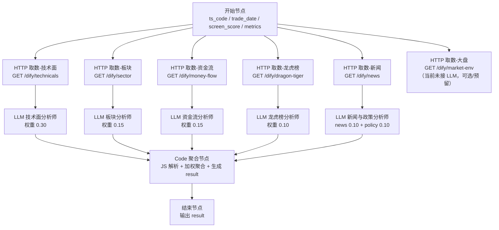

# Dify Workflow 流程图（短线分析师）

> 根据 `dify-workflow-setup.md` 整理的画布节点关系，可直接在 Dify 中按此结构连线。

## 总览图（Mermaid）

## 简要说明

1. **开始节点**：接收 4 个入参：`ts_code`、`trade_date`、`screen_score`、`metrics`。
2. **HTTP 取数层**：从开始节点并行发起 6 个请求，全部需要带请求头 `X-Dify-Token`。
   - 其中“大盘”接口在手册中没有单独接 LLM 分析师，也没有进入 Code 聚合；当前只是“获取数据备用”。如果不需要，可以在 Dify 里先不建 H6，或仅用于人工排查/后续扩展。
3. **LLM 分析层**：5 个 LLM 节点并行，分别消费对应 HTTP 返回的 `body`。
   - 新闻节点一个 LLM 同时输出 `news` 和 `policy` 两个结论。
4. **Code 聚合节点**：接收 5 个 LLM 节点的 `text`，做 JSON 提取、格式纠错、加权打分，并输出 `result` 字符串。
5. **结束节点**：将 Code 节点的 `result` 作为最终输出。

## 连线要点

- 每个 HTTP 节点都从“开始节点”取参。
- 每个 LLM 节点都从“对应 HTTP 节点”取 `body`。
- 所有 LLM 节点都汇聚到同一个“Code 聚合节点”。
- Code 聚合节点必须输出名为 `result` 的字段。
- 发布后回填 `dify.workflow-key` 和 `dify.tools-token`。
